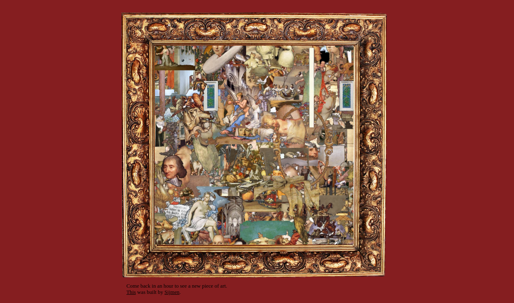

# Willekeurigecreaties
translated: Random Creations

A web-page that shows recycled #art 

## Run it locally

1. Create yourself a folder `app/media` and `app/art`.
2. Put a lot of images in `media` and give the program read access.
3. Give the program write access to output.
4. Install python requirements: `pip install requirements.txt`
5. To run it, go into `app` and `python main.py`
6. Visit `localhost:5000` to view it!

## Deploy it in production

1. Build it: `docker build -t willekeurigecreaties .`
2. Run it: `docker run --rm --name willekeurigecreaties -v $(pwd)/media:/app/media -v $(pwd)/art:/app/art -p 80:5000 willekeurigecreaties`